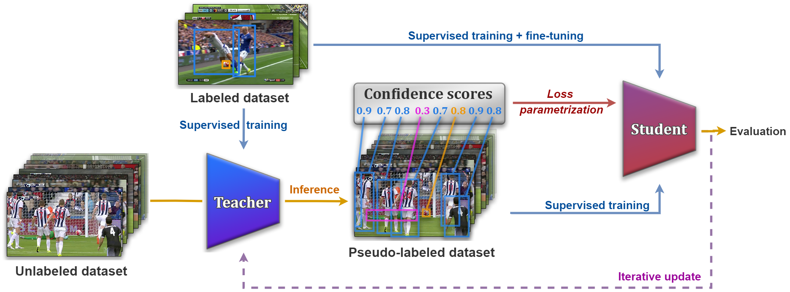
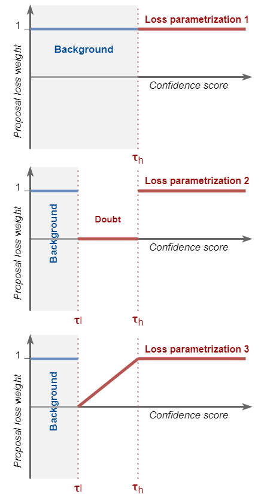

# Semi-Supervised Training to Improve Player and Ball Detection in Soccer

<p align="center"></p>

This repository contains the implementation of the following paper: "Semi-Supervised Training to Improve Player and Ball Detection in Soccer".
This paper will be presented ad CVPRW2022.

This work presents a semi-supervised learning method for object detection in a context of soccer games.
This repository can be used to reproduce the main results of the paper.

<!-- ## bibtex
```
@inproceedings{Vandeghen2022SemiSupervised,
title = {Semi-Supervised Training to Improve Player and Ball Detection in Soccer},
author = {Vandeghen, Renaud and Cioppa, Anthony and Van Droogenbroeck, Marc},
booktitle = {IEEE International Conference on Computer Vision and Pattern Recognition Workshops (CVPRW), CVsports},
month = {June},
year = {2022},
address = {New Orleans, Louisiana, USA},
keywords = {Semi-supervised, Self training, Soccer, Semantic segmentation, Artificial intelligence, Machine learning, Deep learning, TRAIL} 
}
``` -->

## Usage

### Requirements
The code has been tested and runs inside an nvidia-docker with the image: `pytorch:21.11-py3` and the following libraries:
```
matplotlib
torch=1.11
torchvision=0.11
wandb
```

We assume that you have the rights to use the [SoccerNetv3](https://www.soccer-net.org/download) dataset.  
We used the same train/val/test split, and the different games used with subparts of the initial training dataset can be found in the [data](data) folder.  
For the unlabeled dataset, we subsampled every matches at a framerate of `1 FPS`.

The different classes that we consider are the following:
```
CLASS_DICT = {'Ball': 1,
              'Player': 2,
              'Goalkeeper': 3,
              'Main referee': 4,
              'Side referee': 5,
              'Staff members': 6
             }
```


### Training the teacher
To train the teacher, you can use the following command:
```
PORT=$(( $RANDOM % 50 + 10000 ))
torchrun --nproc_per_node=4 --master_addr 127.0.0.1 --master_port $PORT src/train.py \
         --data-path $dataset \
         --split $split \
         --batch-size 8 \
         --epochs 200 \
         --sync-bn \
         --output-dir $save \
         --lr-scheduler plateau \
         --seed 1 \
         --workers 10
```

where `$dataset` is the location of your dataset files, `$split` is the training split you want to use and must be a `json` file (for example `train10_annotations.json`).  
The `json` file is composed as follows:
```
{'/path/to/your/images/image_0.png': {'bbox': [[x1_1, y1_1, x2_1, y2_1, c_1], ..., [x1_n, y1_n, x2_n, y2_n, c_n]]},
...
'/path/to/your/images/image_L.png': {'bbox': [[x1_1, y1_1, x2_1, y2_1, c_1], ..., [x1_m, y1_m, x2_m, y2_m, c_m]]}
}
```
If you want to save your model, you can specify the `$path` that you want.

### Generating the pseudo-labels
After you trained your model, you can generate pseudo-labels with the following command:
```
PORT=$(( $RANDOM % 50 + 10000 ))
torchrun --nproc_per_node=4 --master_addr 127.0.0.1 --master_port $PORT src/train.py \
         --data-path $dataset \
         --split-unlabeled $split_unlabeled \
         --split-labeled $split_labeled \
         --checkpoint $model \
         --output $output \
         --workers 10
```
where `$split_unlabeled` is the unlabeled split that you want to use and must be a `json` file for (for example `unlabeled10_10_annotations.json`).  
The `json` file is composed as follows:
```
{'/path/to/your/images/image_0.png': null,
...
'/path/to/your/images/image_U.png': null
}
```
The different unlabeled matches that we used can be found in the [data](data) folder.  

### Thresholding 
After you generated your pseudo-labels, you can threshold them with the parametrization that you want with the following script:
```
src/threshold.py \
--input-file $output/pseudo_annotations.json \
--output-file $output_file \
--parametrization $param \
--tl $tl \
--th $th
```
<p align="center"></p>

### Training the student
This step is the same as for training the teacher, except that we change the `$split` to the new one.

### Fine-tuning
You can fine-tune the student model with the following script:
```
PORT=$(( $RANDOM % 50 + 10000 ))
torchrun --nproc_per_node=4 --master_addr 127.0.0.1 --master_port $PORT src/train.py \
         --data-path $dataset \
         --split $split \
         --batch-size 8 \
         --epochs 200 \
         --sync-bn \
         --output-dir $save \
         --lr-scheduler plateau \
         --seed 1 \
         --resume $model \
         --workers 10
```

## Authors
* **Renaud Vandeghen**, University of Liège (ULiège),
* **Anthony Cioppa**, University of Liège (ULiège).